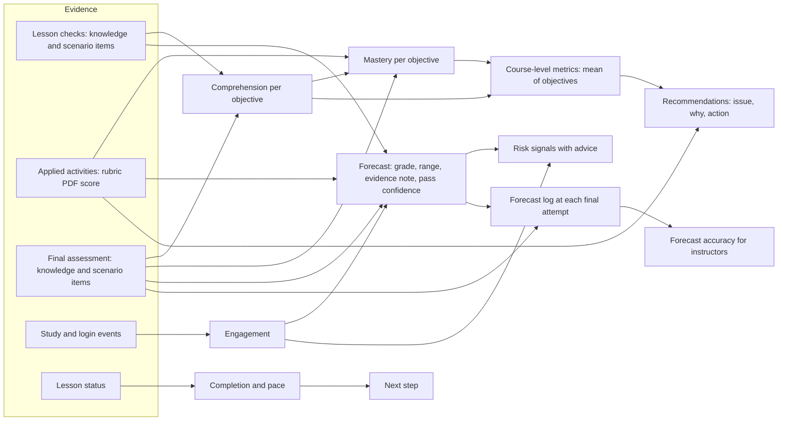

# Architecture and Adaptivity Map

## Architecture summary

- **Stack:** React 19 + Vite + Tailwind (client, `src/`), Express 4 on Node 20+ run with tsx (server, `server/`), shared TypeScript domain and analytics (`shared/`). Single process serves API and app on port 4600.
- **Data:** one JSON file (`data/db.json`) behind `server/db.ts` (`db()`, `save()`); format 8 with in-place upgrade from 7. Uploads in `uploads/`.
- **Learner evidence model (`shared/types.ts`):** `Enrollment.lessons[lessonId]` holds status, active seconds, check attempts with per-item results (`AttemptItem`: question kind and objective), the activity submission with its rubric result, confidence, and reflection. Final attempts and the new `forecastLog` sit on the enrollment. Study and login events are in `events`.
- **Where adaptive decisions are made:** all in pure functions, no randomness:
  - `shared/metrics.ts:177` `computeLearningMetrics`: Comprehension and Mastery per objective, then course mean.
  - `shared/analytics.ts:290` `computePrediction`: projected grade, likely range, evidence note, pass confidence.
  - `shared/analytics.ts:549` `computeNextStep`: the single next action.
  - `shared/analytics.ts:720` `computeRecommendations`: up to six prioritized actions with issue, why, and what to do.
  - `shared/analytics.ts:821` `computeRisk`: risk signals with advice for instructors.
  - `shared/analytics.ts:895` `buildSnapshot`: assembles all of the above; called by the server on every request (`server/services.ts` `snapshotFor`).
- **AI use (`server/ai.ts`):** only for the study coach, transcript translation, speech-to-text, and an optional rubric score suggestion. **No AI output feeds the forecast, metrics, next step, recommendations, or risk.** AI calls are off unless a key is configured.
- **Seed and mocks:** `server/seed.ts` creates four starter accounts and five draft courses. No demo flags or mocked forecast values exist in the runtime. The mock AI service exists only in tests.

## Evidence flow

Note: Completion and time spent (`ST`, `EV`) never reach Mastery or Comprehension.

## Differential response walkthrough

Run with `npm test` (tests/adaptivity.test.ts) on the real "AI Fluency for the Workplace" course, every activity rubric-scored out of 20. Output: `tests/out/adaptivity.json`.

| Learner profile | Completion | Comprehension | Mastery | Forecast range | Next step | Recommendations | Instructor risk signals |
|---|---|---|---|---|---|---|---|
| A. Strong comprehension, weak mastery | 60% | 100 | 58 | 59-85 (solid) | Next up: Day 7: Privacy, accuracy, and judgment | Improve "My AI Capability Checklist" (rubric 30%); Improve "My Personal Use-case List" (rubric 30%) | Low chance of passing (50%); 6 applied activities below 60% on the rubric |
| B. Behind pace but capable | 20% | 100 | 94 | 70-100 (early) | Next up: Day 3: Writing useful prompts | Build your rhythm: 2 more short sessions this week | No study for 9 days; Not signed in this week |
| C. Weak on one objective | 60% | 89 | 87 | 74-100 (solid) | Strengthen: Writing useful prompts | Strengthen "Writing useful prompts" (33%) | Weak topic: Writing useful prompts (33%) |
| D. Very little evidence (one quiz) | 10% | Not measured | Building evidence | 37-75 (early) | Next up: Day 2: Common workplace AI use cases | Strengthen "What AI can and cannot do" (67%); Build your rhythm: 2 more short sessions this week | Signed in only 1 day this week |
| E. High performer near the final | 100% | 100 | 97 | 89-100 (solid) | Take your final assessment | None needed | None |

### Reading the results
- **A (strong comprehension, weak mastery):** Comprehension 100 but Mastery lower, driven only by rubric scores. Before the fixes this learner received **no** recommendations and a forecast that counted every activity as 100%.
- **B (behind pace but capable):** wide range because little is graded; rhythm guidance and inactivity signals, but no "low chance of passing" from thin evidence (previously flagged).
- **C (weak on one objective):** next step goes straight to the weak topic, ahead of new content.
- **D (one quiz):** "Early estimate" with a range of about 38 points; Comprehension and Mastery say "not measured yet" rather than showing a number.
- **E (high performer):** narrow range, next step is the final, no noise.

### Consistency and edge cases (all Confirmed by tests)
- Identical evidence gives identical output (deep equality on full snapshots).
- No enrollment, an empty course, and all-zero scores produce finite values and no division by zero.
- Retakes: best check score feeds the forecast; first attempt is kept for calibration of confidence.
- Course edits mid-enrollment: attempts store the question kind and objective at answer time, so later edits do not rewrite past evidence; rubric results store the rubric name and total used.
- Unscored submissions count as pending, never as full marks.
